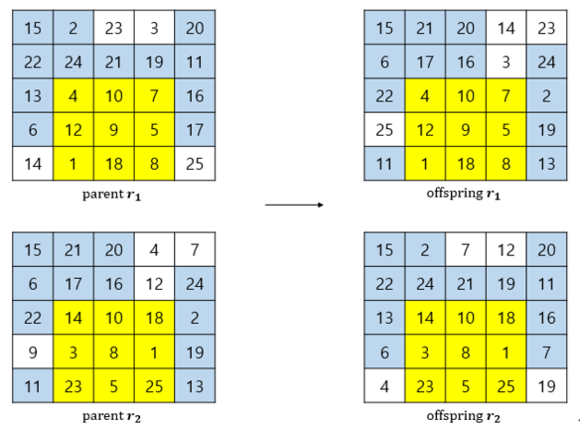

# Hybrid Genetic Algorithm with RPMX

This is java implementation of promising paper "Finding profitable product assignment plans with weighted product associations in retail using hybrid genetic algorithm". In this paper, we propose rectangular partially mapped crossover (RPMX) which adapt original PMX to rectangular format to efficiently solve product assignment problem.

<p align="center">
  
</p>

<p align="center">
  <strong>Figure. Rectangular PMX</strong>
</p>

## run main
```
$ cd ~/src
$ mkdir "../bin"
$ javac -cp "../jars/argparse4j.jar"; -d "../bin" main.java
$ java -cp "../jars/argparse4j.jar";"../bin" main -f "../qapdata/tai40a.dat"
```

### arguments
```
-----------------------------------------------------------------------------------------------------------------
usage: main [-h] [-f FILE] [-ngen NGEN] [-npop NPOP] [-r {true,false}]

Test proposed hybrid genetic algorithm

named arguments:
  -h, --help             show this help message and exit
  -f FILE, --file FILE   Specify path to file (default: None)
  -ngen NGEN             Specify the number of generation (default: 200)
  -npop NPOP             Specify size of population (default: 300)
  -r {true,false}, --rect {true,false}
                         Convert to Rectangle Format (default: true)
-----------------------------------------------------------------------------------------------------------------
```

## run test
```
$ javac -cp "../jars/argparse4j.jar"; -d "../bin" test.java
$ java -cp "../jars/argparse4j.jar";"../bin" test -nrow 5 -ncol 5
```

### arguments
```
-----------------------------------------------------------------------------------------------------------------
usage: main [-h] [-ngen NGEN] [-npop NPOP] [-nrow NROW] [-ncol NCOL]

Test proposed hybrid genetic algorithm

named arguments:
  -h, --help             show this help message and exit
  -ngen NGEN             Specify the number of generation (default: 200)
  -npop NPOP             Specify size of population (default: 300)
  -nrow NROW             Specify number of rows (default: 5)
  -ncol NCOL             Specify number of cols (default: 5)
-----------------------------------------------------------------------------------------------------------------
```

## Requirement

- JDK 8
