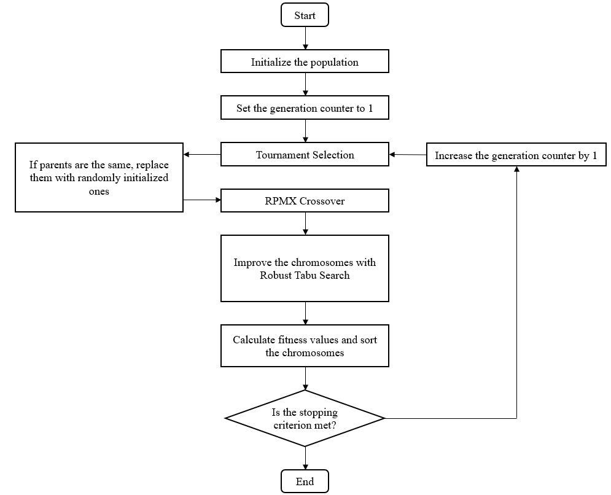
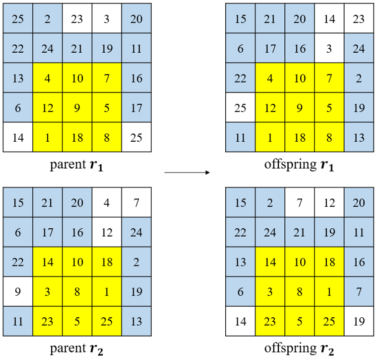
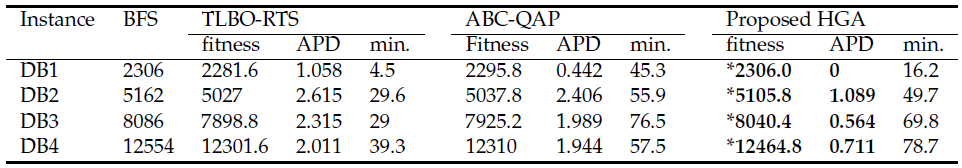

# Hybrid Genetic Algorithm with RPMX

This is java implementation of promising paper "Finding profitable product assignment plans with weighted product associations in retail using hybrid genetic algorithm". In this paper, we propose rectangular partially mapped crossover (RPMX) which adapt original PMX to rectangular format to efficiently solve product assignment problem.

<p align="center">
  
</p>

<p align="center">
  <strong>Figure 1. Flowchart of proposed HGA</strong>
</p>

<br></br>

We also proposed a new crossover method, Rectangular Partially Matched Crossover, which is modified version of PMX. This crossover method shows better performance on the given retail situations with the proposed procedure.

<p align="center">
  
</p>

<p align="center">
  <strong>Figure 2. Rectangular PMX</strong>
</p>

<br></br>

## _1. run code for QAPLIB examples_
You can run HGA-RPMX to solve an example _tai40a_ from QAPLIB following code:
```
$ cd ~/src
$ mkdir "../bin"
$ javac -cp "../jars/argparse4j.jar"; -d "../bin" main.java
$ java -cp "../jars/argparse4j.jar";"../bin" main -f "../qapdata/tai40a.dat"
```

### _arguments_
```
-----------------------------------------------------------------------------------------------------------------
usage: main [-h] [-f FILE] [-npop NPOP] [-r {true,false}]

Test proposed hybrid genetic algorithm

named arguments:
  -h, --help             show this help message and exit
  -f FILE, --file FILE   Specify path to file (default: None)
  -npop NPOP             Specify size of population (default: 20)
  -r {true,false}, --rect {true,false}
                         Convert to Rectangle Format (default: true)
-----------------------------------------------------------------------------------------------------------------
```

<br></br>

## _2. run code for synthetic datasets_
```
$ javac -cp "../jars/argparse4j.jar"; -d "../bin" test.java
$ java -cp "../jars/argparse4j.jar";"../bin" test -nrow 5 -ncol 5
```

### _arguments_
```
-----------------------------------------------------------------------------------------------------------------
usage: main [-h] [-npop NPOP] [-nrow NROW] [-ncol NCOL]

Test proposed hybrid genetic algorithm

named arguments:
  -h, --help             show this help message and exit
  -npop NPOP             Specify size of population (default: 20)
  -nrow NROW             Specify number of rows (default: 5)
  -ncol NCOL             Specify number of cols (default: 5)
-----------------------------------------------------------------------------------------------------------------
```

<br></br>

## _3. experimental results_

<p align="center">
  
</p>

<p align="center">
  <strong>Figure 3. Experimental results on QAPLIB</strong>
</p>

<p align="center">
  
</p>

<p align="center">
  <strong>Figure 4. Experimental results on synthetic datasets</strong>
</p>

<br></br>

## _4. Requirement_

- JDK 8
